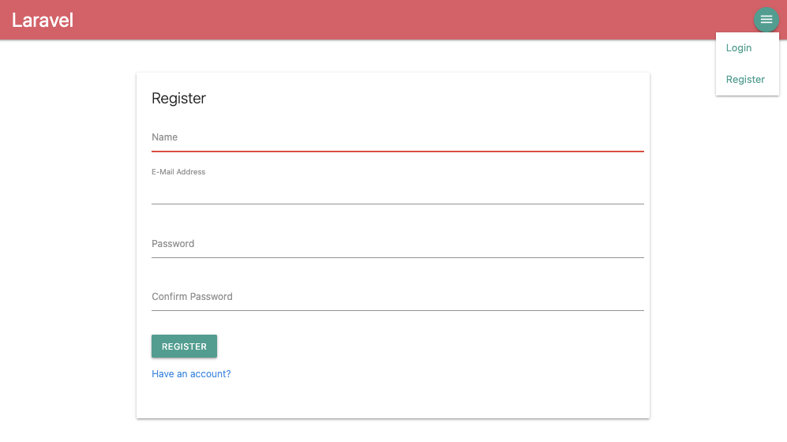
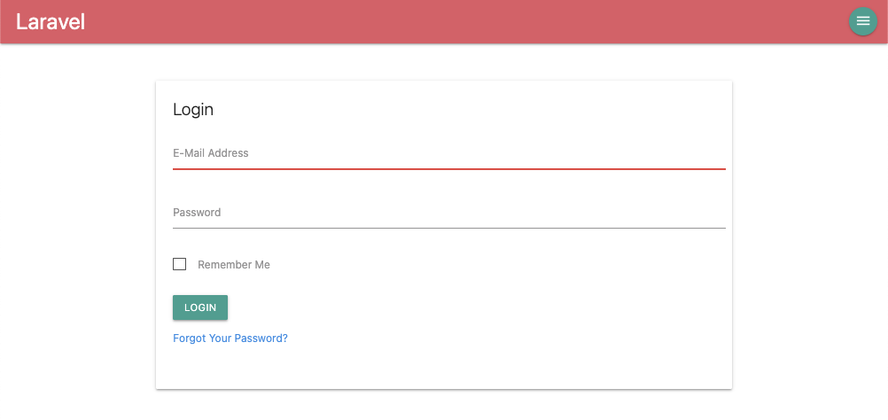
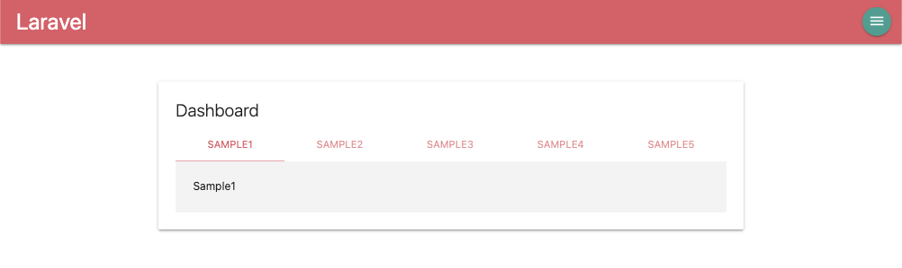
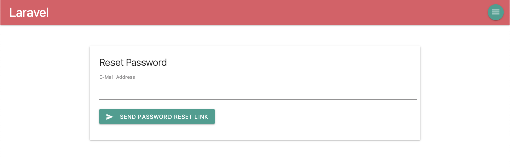
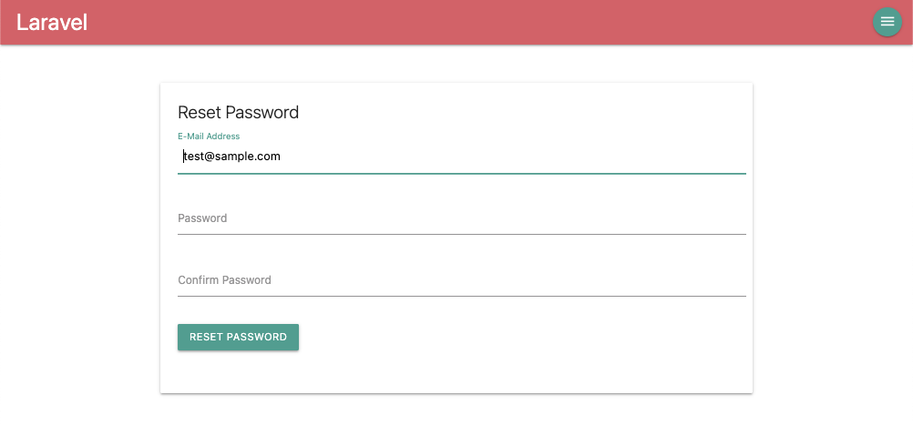
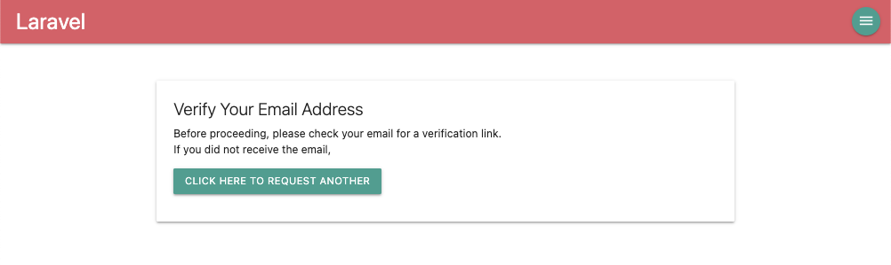
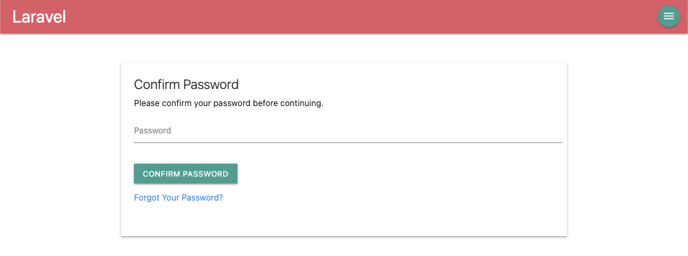

# Laravel8 Auth widh MaterializeCSS

By default, `php artisan make:auth` generates authentication boilerplate templates using Boostrap.

This project allows you to replace that with MaterializeCSS instead.

## How to Use

1. Git clone this repositorory, or download as zip

1. `composer install`

1. create `.env` file

1. `php artisan key:generate`

1. `php artisan migrate`

1. `npm install`

1. `npm run dev`

1. `php artisan serve`

- open <a href="http://127.0.0.1:8000" target="_blank">http://127.0.0.1:8000</a> in your browser

### Use japanese resources

This project contains Japanese resources.
If you want to use it, change the following settings.

- `config/app.php`

    ```
        ...

    -   'locale' => 'en',
    +   'locale' => 'ja',
        ...

    -   faker_locale' => 'en_US',
    +   'faker_locale' => 'ja_JP',
        ...
    ```

### Use email verify

If you want to use email verify, change the following settings.

- add smtp setting to `.env`

- `app/Models/User.php`

    ```
          <?php
          namespace App\Models;

        - use Illuminate\Contracts\Auth\MustVerifyEmail;
          ...

        + use Illuminate\Contracts\Auth\MustVerifyEmail as MustVerifyEmailContract;
        + use Illuminate\Auth\MustVerifyEmail;

        - class User extends Authenticatable
        + class User extends Authenticatable implements MustVerifyEmailContract
          {
                ...
    ```

- `routes/web.php`

    ```
        ...

    -   Auth::routes();
    +   Auth::routes(['verify' => true]);
        ...

    -   Route::get('/home', [App\Http\Controllers\HomeController::class, 'index'])->name('home');
    +   Route::get('/home', [App\Http\Controllers\HomeController::class, 'index'])->name('home')->middleware('verified');
    ```

## How to build

1. `composer self-update`

1. `composer create-project laravel/laravel --prefer-dist [app-name]`

1. modify `.env`

1. `composer require laravel/ui`

1. `php artisan ui bootstrap --auth`

1. `npm install`

1. change the css framework from bootstrap to materialize-css

    - `npm i materialize-css --save-dev`

    - `npm uninstall bootstrap`

    - modify `resources/sass/app.scss`

        ```
        - @import '~bootstrap/scss/bootstrap';

        + @import url('https://fonts.googleapis.com/icon?family=Material+Icons'); // add
        + @import '~materialize-css/sass/materialize.scss'; // add
        ```

    - modify `resources/js/bootstrap.js`

        ```
          try {
              window.Popper = require('popper.js').default;
              window.$ = window.jQuery = require('jquery');

        -     require('bootstrap');
        +     window.M = require('materialize-css');
          } catch (e) {}
        ```

    - modify views file

- `npm run dev` or `npm run prod`

    If the following message is displayed, try again `npm run dev` or `npm run prod`.

    > Additional dependencies must be installed. This will only take a moment.
    > Running: npm install resolve-url-loader@3.1.0 --save-dev --legacy-peer-deps
    > Finished. Please run Mix again.

- `php artisan migrate`

- `php artisan serve`

- open <a href="http://127.0.0.1:8000" target="_blank">http://127.0.0.1:8000</a> in your browser

## Screenshots















